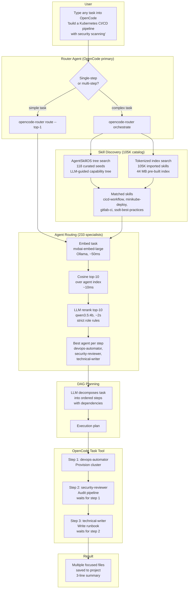

# Architecture

`opencode-router` is a local-first orchestration layer that combines
**skill discovery** (105K+ catalog + AgentSkillOS tree), **agent
routing** (two-stage semantic dispatch), and **DAG planning** into a
single pipeline triggered from within OpenCode.

## Full pipeline

## Three layers

### 1. Skill discovery (105K+ catalog)

Before routing to agents, the pipeline searches the skill catalog to
find relevant capabilities. Two search strategies run in parallel:

- **AgentSkillOS tree search** — LLM-guided traversal of a pre-built
  capability tree over 118 curated seed skills. Finds skills by
  navigating a hierarchy rather than keyword matching.
- **Tokenized index search** — tokenized pre-built index over 105K
  imported skills (44 MB JSON, cached in memory after first load).
  Matches skill names and descriptions against task query tokens.

Combined results feed into agent routing to expand the candidate pool.

### 2. Agent routing (233 specialists)

A two-stage pipeline that picks the right specialist for each step:

1. **Embed** the task with `mxbai-embed-large` (Ollama, ~50ms).
2. **Cosine search** over the pre-built 1024-dim agent index (~10ms).
3. **LLM rerank** — top-10 candidates go to `qwen3.5:4b` which applies
   explicit role+domain rules and strict JSON output (~2s).

This avoids both embedding-only surface-word traps (e.g. `users.email`
matching `email-intelligence-engineer` instead of `database-optimizer`)
and the cost of putting 200+ agent descriptions in one prompt.

### 3. DAG planning

For complex tasks, an LLM decomposes the work into ordered steps with
dependencies. Each step is assigned to the best agent from the routing
stage. The result is a directed acyclic graph: "step-1 → step-2 (waits
for step-1), step-3 (waits for step-2)".

## What's deliberate, what's swappable

**Deliberate:**
- Two-stage retrieval (embed → rerank) — neither stage alone reaches
  required accuracy.
- The bucket abstraction (`pro`, `flash`, `coding`, `visual`, `chinese`,
  `translation`) separates role logic from provider details.
- Index excludes `mode: primary` agents (otherwise the router
  recommends itself).

**Swappable:**
- Embedding / rerank models — set `OPENCODE_ROUTER_EMBED_MODEL` and
  `OPENCODE_ROUTER_RERANK_MODEL`.
- Ollama URL — set `OPENCODE_ROUTER_OLLAMA_URL`.
- Routing rules — write `~/.config/opencode/orchestration-rules.json`.
- Provider profiles — edit `~/.config/opencode/orchestration-profile.json`.
- Router prompt — copy `examples/router-prompts/default.md`, edit, drop in.
- Skill catalog — run `scripts/import-skills.py` to refresh.
